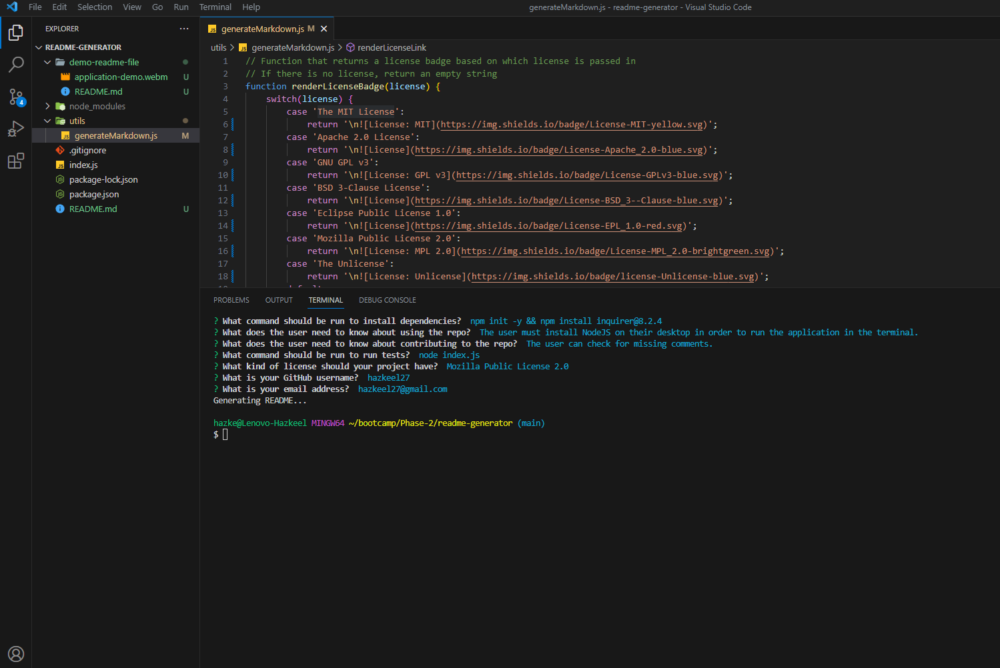
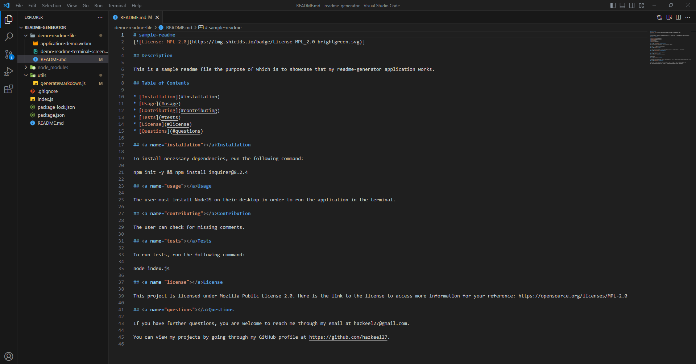

# README-GENERATOR 📝


## Description 📄

Introducing the README File Generator - a command-line tool that automates the creation of clear and organized README files for your projects. Simply answer a few questions, and the generator will do the rest, saving you time and effort. Elevate your project's documentation with ease and improve collaboration among developers. Try it now and experience hassle-free README creation!

## Table of Contents 📑

* [Installation](#installation) 🛠️
* [Usage](#usage) 📘
* [Contributing](#contributing) 🤝
* [Tests](#tests) 🧪
* [License](#license) 📜
* [Credits](#credits) 🙏
* [Questions](#questions) ❓

## <a name="installation"></a>Installation 🚀

To install the necessary dependencies, run the following command:

```
npm i
npm install inquirer@8.2.4
```

## <a name="usage"></a>Usage 📘

- The user must install visual studio code to run the application.
- Then the user must install the NodeJS library to use the inquirer dependency within the terminal.

The following is a video demo running the application and generating a sample readme file. 🎥

[](https://www.youtube.com/watch?v=ruoO-bGWjFw)

The following is the screenshot of the terminal with questions and their answer for the sample readme file as well as the generated sample readme file. 📷




## <a name="contributing"></a>Contribution 🤝

This application asks the user a series of questions and then inserts the answers within the generated readme file. However, it does not check for invalid inputs and it does not give the user option to choose the contents of the readme file. Contributors can help in resolving this issue.

## <a name="tests"></a>Tests 🧪

To run tests, run the following command:

```
node index.js
```

## <a name="license"></a>License 📜

This project is licensed under The MIT License. Here is the link to the license to access more information for your reference: https://opensource.org/licenses/MIT

## <a name="credits"></a>Credits 🙏

I utilized the study material provided by the institution as a reference to complete my application.

Following are the documents I used to help me write code:

- https://www.npmjs.com/package/inquirer#questions

## <a name="questions"></a>Questions ❓

If you have further questions, you are welcome to reach me through my email at hazkeel27@gmail.com.

You can view my projects by going through my GitHub profile at https://github.com/hazkeel27.
